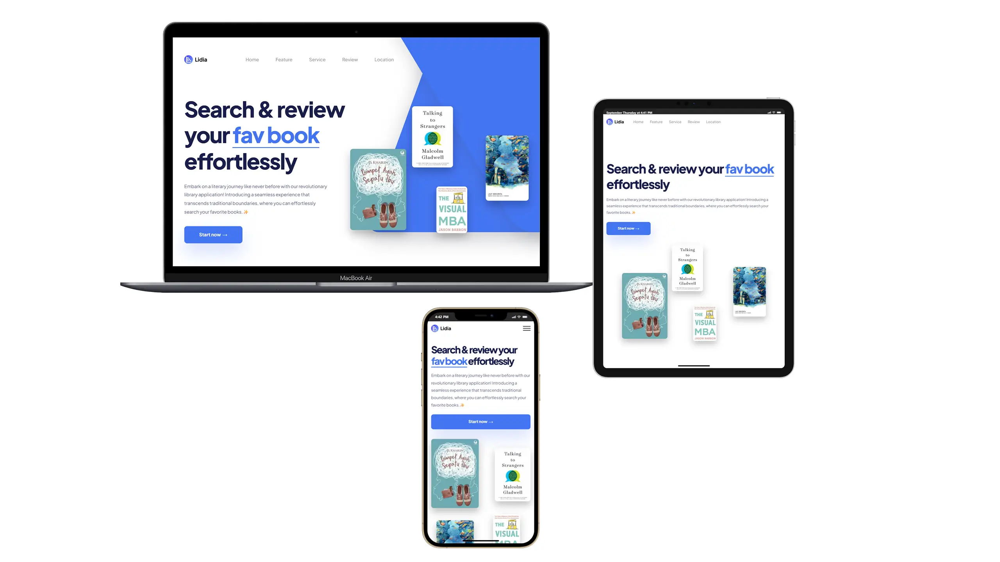

# Lidia

**Role:**  
Front-End Developer | Responsive Design | JavaScript Interactivity | CSS Grid  

🌐 [View Live Project](https://oleksandrmul.github.io/lidia/)

---

## Overview  
Built a fully responsive **one-page website** for a book discovery platform, offering users a seamless way to explore and search their favorite titles. Focused on **engaging animations, interactive UI, and thoughtful layout design** to deliver a modern and user-friendly browsing experience.  

---

## Key Achievements  
- ✅ Implemented **parallax animations** triggered by mouse movement and scroll, creating a dynamic hero section with four floating book covers moving in opposite directions.  
- ✅ Designed the **hero layout** using **CSS Grid** with custom `grid-row` properties, achieving a unique staggered card design that highlights featured books.  
- ✅ Added **smooth scroll navigation**, **hover animations**, and a **JavaScript-powered burger menu** for mobile optimization.  
- ✅ Integrated and fully **custom-styled Google Maps** to match the site’s design language.  
- ✅ Followed **best practices** for semantic HTML5, SCSS structuring, and **mobile-first development** to ensure reliability and performance.  

---

## Outcome  
The result is a **lightweight, visually engaging landing page** with an intuitive interface and polished animations. The parallax effects and unique grid layout create a memorable first impression, while responsive design ensures accessibility across all devices.  

---

## Conclusions  
This project demonstrates my ability to combine **modern design techniques with advanced front-end development**, delivering websites that are not only visually impressive but also functional and business-oriented.  

If you’re looking for a **developer who can craft interactive, high-performance web experiences**, let’s discuss how I can support your next project 🤝.  

